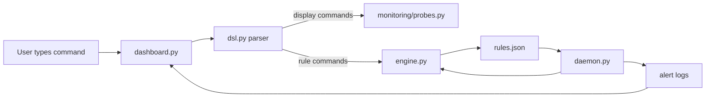

# Nano-DSL File Roles and How They Connect

This document explains what each important file in the project does, how the pieces talk to each other, and how the background daemon, `rules.json`, and the metric registries fit together.

## Big Picture

Nano-DSL has two main jobs:

1. Read user commands in the dashboard and show system information.
2. Keep alert rules running in the background even after the dashboard is closed.

That is why the project has both a dashboard process and a daemon process. The dashboard is the interactive front end. The daemon is the always-on worker that evaluates rules and writes alert output.

## Why the dashboard checks whether `daemon.py` is already running

The dashboard checks for the daemon so it does not accidentally start multiple background workers for the same project state.

This check is not about looking for random scripts you wrote before. It is specifically about the project’s own background alert process. If the daemon is already running, the dashboard can reuse it instead of spawning another one.

That matters because:

- the daemon is the process that keeps monitoring rules continuously,
- the dashboard and daemon share rule state through files,
- and duplicate daemons would evaluate the same rules twice and create duplicate alerts.

So the check is a safety step for the project’s own background monitoring system.

## Is `rules.json` where all rules live?

Yes. `rules.json` is the persistent storage for active rules.

It is the shared state file used by both processes:

- the dashboard writes updated rules there when you add or stop a rule,
- the daemon reads it so it knows which rules should be active,
- and both sides use it as the common source of truth for the current rule set.

The rules also exist in memory while the program is running, but `rules.json` is the saved version that survives process restarts.

## Why there are two metric registries

This is the part that often looks confusing at first.

The project uses two related but different views of the same metrics:

- `nano_logic/dsl.py` is focused on user-facing command output.
- `nano_logic/engine.py` is focused on alert evaluation.

The DSL transformer returns nicely formatted strings for humans, such as readable CPU, memory, or disk output.

The engine, however, needs raw numeric values so it can compare them against thresholds like `> 80` or `< 10`.

That is why `engine.py` keeps a separate registry, `_METRIC_REGISTRY`:

- the DSL side formats values for display,
- the engine side fetches raw numbers for rule checks.

They are not duplicates by accident. They serve two different purposes.

### Simple example

If a user types:

`cpu.util`

the dashboard should show a human-readable value.

If a rule says:

`alert cpu.util > 80 -> log`

the engine needs the actual numeric CPU percentage so it can decide whether the condition is true.

So the same metric name appears in both places, but one version is for display and one version is for alert logic.

## How the main files connect

### `nano_logic/dashboard.py`

The interactive Textual dashboard.

Responsibilities:

- accepts user commands,
- shows live metrics,
- starts the daemon when needed,
- displays active rules,
- and tails alert logs so fired rules become visible in the UI.

### `nano_logic/dsl.py`

The parser and command executor.

Responsibilities:

- defines the grammar for the DSL,
- parses commands such as `cpu.util`, `rules`, and `alert ...`,
- converts parsed input into display text or rule objects,
- and delegates metric reads to the monitoring layer.

### `nano_logic/engine.py`

The rule engine and persistence layer.

Responsibilities:

- stores active rules in memory,
- assigns rule IDs,
- saves and loads rules from `rules.json`,
- evaluates alert conditions,
- and records alert state so rules do not flood repeatedly.

### `nano_logic/daemon.py`

The always-on monitoring process.

Responsibilities:

- runs in the background,
- reloads rule state from `rules.json`,
- evaluates active rules on a loop,
- and writes alerts to log files.

### `nano_logic/daemon_lock.py`

A safety layer for the background daemon.

Responsibilities:

- prevents multiple daemon instances from running at the same time,
- acts like a singleton lock for the monitoring worker.

### `nano_logic/monitoring/probes.py`

The system data collection layer.

Responsibilities:

- gathers CPU, memory, disk, process, network, and other system data,
- returns raw values that the DSL and engine can use,
- keeps probing logic separate from UI formatting.

### `nano_logic/models.py`

Data structures used by the project.

Responsibilities:

- defines rule objects and other shared model types,
- keeps the data shape consistent between parser, engine, dashboard, and daemon.

### `nano_logic/paths.py`

Project state directory resolution.

Responsibilities:

- decides where `rules.json`, logs, and state files are stored,
- keeps those paths stable across different working directories,
- lets the project use a proper state folder instead of relying on the current directory.

### `nano_logic/logging_config.py`

Shared logging setup.

Responsibilities:

- writes project logs to a stable location,
- captures background-process errors that would otherwise be hidden.

### `nano_logic/ui/guide.py`

In-app help text.

Responsibilities:

- provides quick usage guidance inside the dashboard,
- mirrors the common commands users can try.

### `tests/`

Automated tests for the DSL and behavior.

Responsibilities:

- verify parser behavior,
- check rule handling,
- and protect against regressions in alert logic and command output.

## How data flows through the project

## How to add a new rule

Follow these steps:

1. Open the dashboard.
2. Type a rule in the alert format, for example:
   `my_rule : alert cpu.util > 80 -> log`
3. Press Enter to submit it.
4. The dashboard parses the rule and adds it to the active rule list.
5. The updated rules are saved to `rules.json`.
6. The daemon reads the updated file and starts watching the new rule.
7. If the condition becomes true, the daemon writes an alert to the rule’s log file.
8. The dashboard can show the alert output in its console.

### Example rules

- `alert cpu.util > 80 -> log`
- `disk_alert : alert disk.free < 5 -> log`
- `test_rule : alert mem.util > 90 -> log`

### How to stop a rule

Use:

`stop rule <id>`

or:

`stop rule <name>`

Example:

`stop rule disk_alert`

## What each saved file is for

- `rules.json` stores active rules.
- Log files under the state directory store alert history for each rule.
- The shared project log file stores runtime and background errors.

## Short summary

If you want the simplest mental model, think of it like this:

- `dashboard.py` = user interface
- `dsl.py` = command parser
- `engine.py` = rule logic and saved state
- `daemon.py` = continuous background monitor
- `monitoring/probes.py` = system metric collector
- `rules.json` = persistent rule storage
